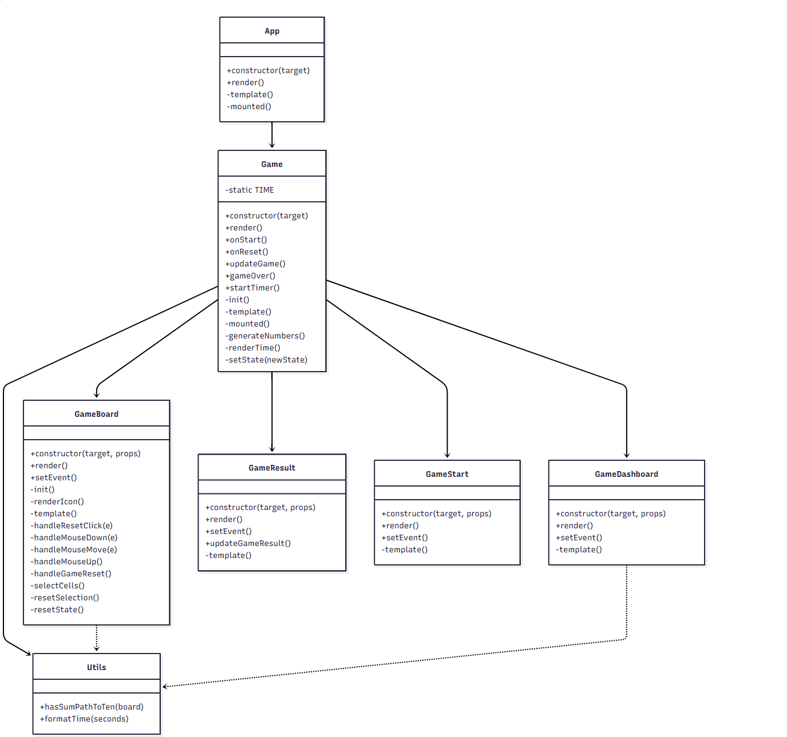
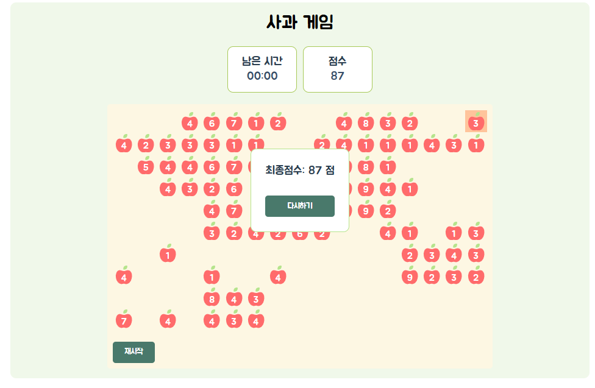

# 사과게임

### [사과 게임](https://jeong922.github.io/apple_game/)

## 목표

- 바닐라 자바스크립트와 클래스 문법을 사용하여 간단한 사과 게임 만들기

## 기술

      

## 설계

⬇️ 설계이므로 실제 구현과 조금 다를 수 있다.

- 남은 시간 구현
  - 제한 시간은 2분으로 구현
  - 중간에 정지하는 기능 없음
- 현재 점수 구현
  - 사과 수 만큼 점수 증가
- 보드 업데이트 구현
  - 재시작 버튼을 누르면 게임 초기화
- 숫자 선택 방법
  - 선택된 숫자가 10이 되는지 확인
    - 선택된 숫자들을 저장하고 값을 확인
- 보드에 남아있는 숫자들 중 10이 되는 경우가 하나도 없는 경우 찾기
  - ~~BFS로 확인 → 잘못된 방법~~
  - 사각형을 확장하면서 10 조합이 있는지 확인 → 완전탐색 + 누적합
- 마우스 무브 이벤트 줄이기
  - 필요한 부분에서 이벤트를 할당
- 타이머와 렌더링
  - 타이머 업데이트 될때마다 render함수가 호출되어 전체 렌더링이 발생하는 문제를 UI 업데이트 부분을 분리
- 게임 종료 조건
  - 남은 시간이 0이 되면 게임 종료
- 게임이 종료 되면 점수 출력 및 재시작 버튼 출력

⬇️ AI를 이용해 그린 클래스 다이어그램

<p align='center'>
  
</p>

## 구현

<p align='center'>
  
</p>

### 게임 시작

- 게임 시작 전, 게임에 대한 설명 출력
- 게임 시작 버튼을 누르면 `Game.onStart()` 호출하여 게임이 시작되고, 보드 초기화 및, 타이머 시작
- 게임 난이도 조절을 위해 작은 숫자가 더 많이 나오도록 설정
  - 70% 확률: 값이 1~4 (낮은 값 → 난이도 낮음)
  - 30% 확률: 값이 5~9 (높은 값 → 난이도 높음)
    ```js
    // game.js
    generateNumbers = () => {
      return Array.from({ length: 10 }, () =>
        Array.from({ length: 17 }, () => {
          const rand = Math.random();
          return rand < 0.7 ? Math.floor(Math.random() * 4) + 1 : Math.floor(Math.random() * 5) + 5;
        })
      );
    };
    ```

### 사과 선택

- `GameBoard`에서 사과를 드래그 하여 선택
- 선택된 사과 합계가 10이면 사과 수 만큼 점수 증가
- 만약, 남은 사과가 10을 만족하는 경우의 수가 없는 경우 새로운 보드 생성

  - `hasSumPathToTen(newNumbers)`로 합이 10인 경로가 있는지 체크하고, 없으면 `generateNumbers()`로 새 보드를 생성
  - `setTimeout`을 이용해 상태 갱신과 이벤트 루프 충돌 방지

```js
// game.js

updateGame = (arr) => {
  // ...

  if (!hasSumPathToTen(newNumbers)) {
    setTimeout(() => {
      this.setState({ numbers: this.generateNumbers() });
    }, 100);
  }
};
```

### 점수 및 시간 갱신

- `GameDashboard`에서 실시간 점수와 남은 시간 표시

### 게임 종료

- 제한 시간이 끝나면 `Game.gameOver()` 호출
- `GameResult.updateGameResult()`를 통해 최종 점수 표시
<p align='center'>
  
</p>

### 테스트

- Jest
- Babel (테스트 환경에서 ES6+ / ESNext 문법 지원)
